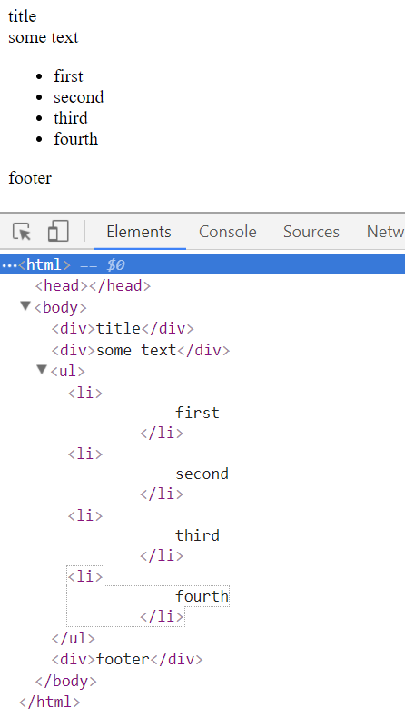

## Description
Make the HTML file that, when loaded into a browser, generates the following DOM:


When you are done, take a screenshot and place the file in this directory. Don't forget to push your repository so that the TAs and teacher can see it.


## Reference

Your file should have this structure:

```
<html>
   <head>
   </head>
   <body>
      ...
   </body>
</html>
```