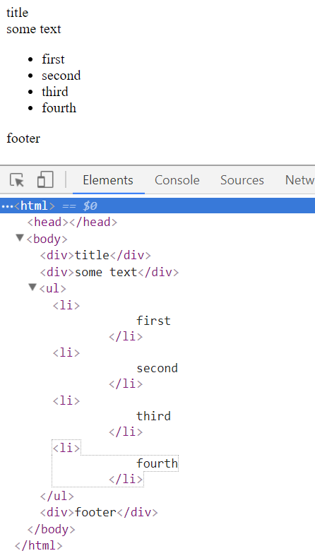

## Description
Load the index.html file directly in the browser. Then modify the DOM directly in the browser so that it matches the following

When you are done, take a screenshot and place the file in this directory. Don't forget to push your repository so that the TAs and teacher can see it.

