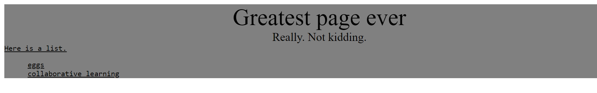

## Description
The style.css file contains errors. Modify that file, and only that file, to produce the following output:

## Reference

.classname {  
    ...  
}  
&#35idname {  
    ...  
}  
tagname {  
    ...  
}